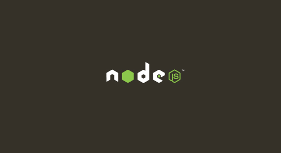
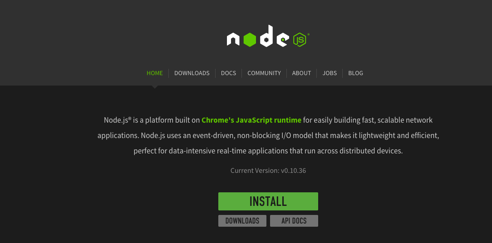
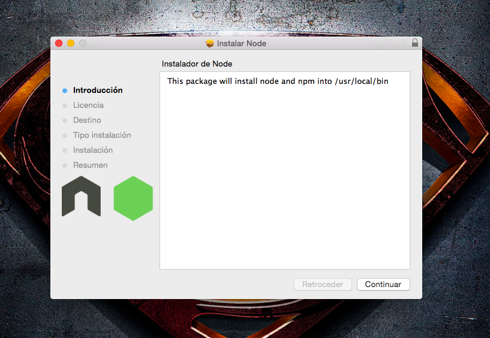
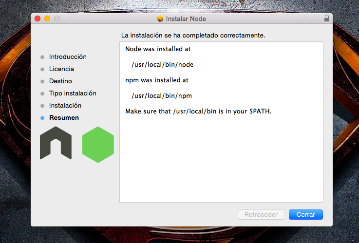
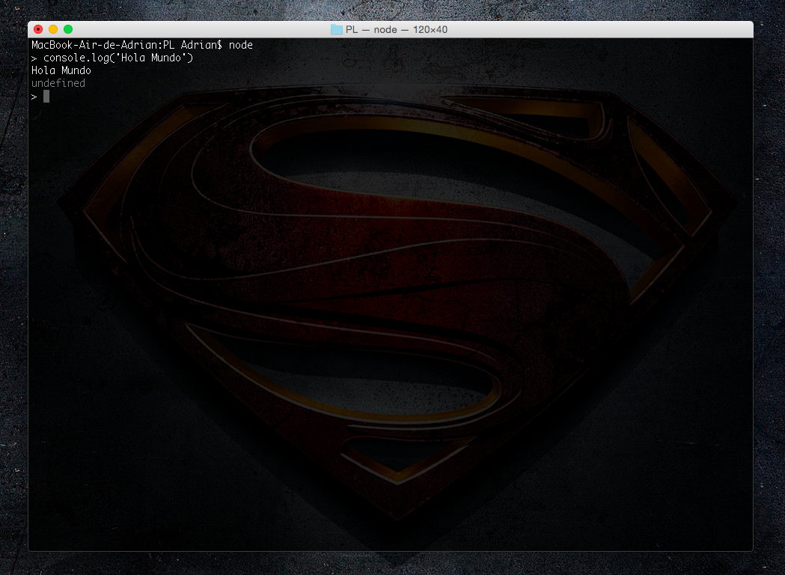
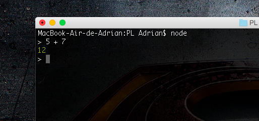
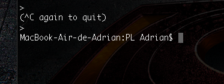

Práctica 1. Tutorial Node.JS
============================

#¿Qué es Node.JS?
Node es un intérprete Javascript del lado del servidor. Su meta es permitir a un programador construir aplicaciones altamente escalábles y escribir código que maneje decenas de miles de conexiones simultáneas en una sólo una máquina física.
#Instalación de Node.JS en Mac.
1. Descargue Node.JS de su página oficial www.nodejs.org

2. Abra el paquete descargado. Se le abrirá una ventana como esta:

  * Junto a node se instalará la herramienta 'npm' que se encargará de añadir las nuevas herramientas que el usuario necesite.

#Primeros pasos con Node.JS (Hola Mundo).
1. Abra un terminal.
2. Escriba la orden "node" para entrar en la consola de node.JS.
3. Escriba: "console.log('Hola Mundo')".

## Ejemplo de una suma en node.js.
1. Escriba en la consola de node la siguiente sentencia: "5 + 7", verá que obtendrá el resultado de la operación.

## Salir de la consola de node.js.
1. Presione ctr-c dos veces para salir.

#Bibliografía.
* Pérez, Mario. Node.JS - Primeros pasos y "Hola Mundo" | Geeky Theory [En línea].<http://geekytheory.com/node-js-primeros-pasos-y-hola-mundo/> [Consulta: Enero 2015].
* Kiessling, Manuel, Junge, Herman. El Libro para Principiantes en Node.js» Un tutorial completo de node.js [En línea].<http://www.nodebeginner.org/index-es.html> [Consulta: Enero 2015].
